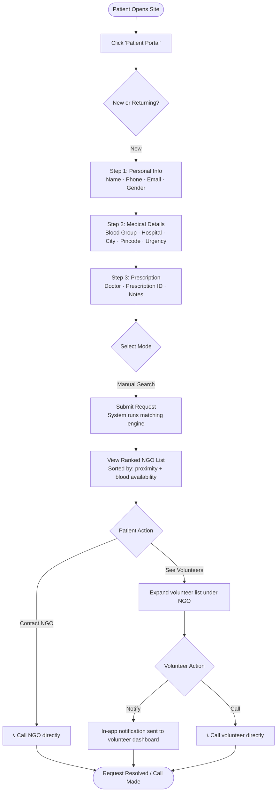
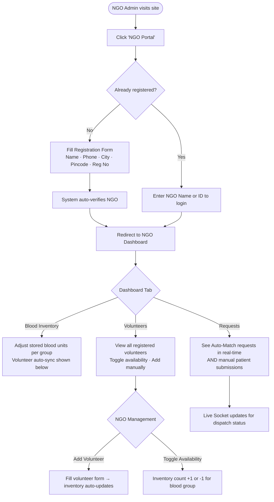
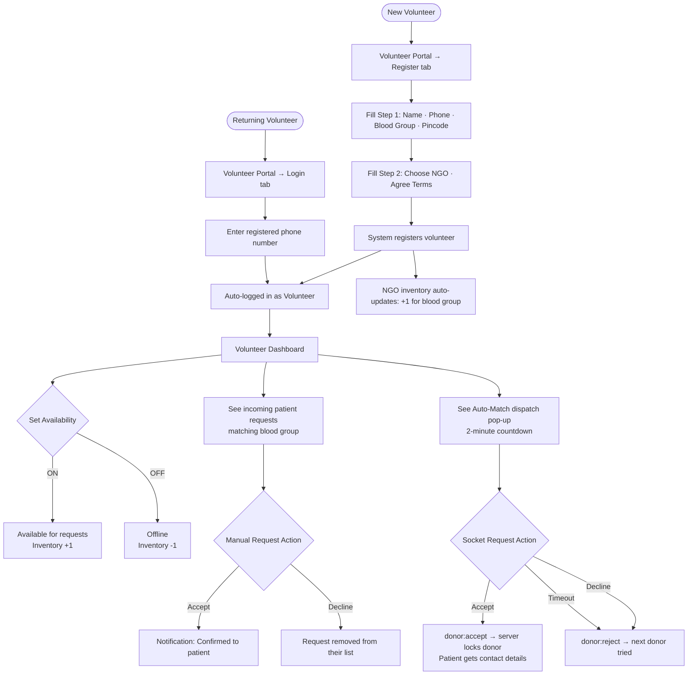
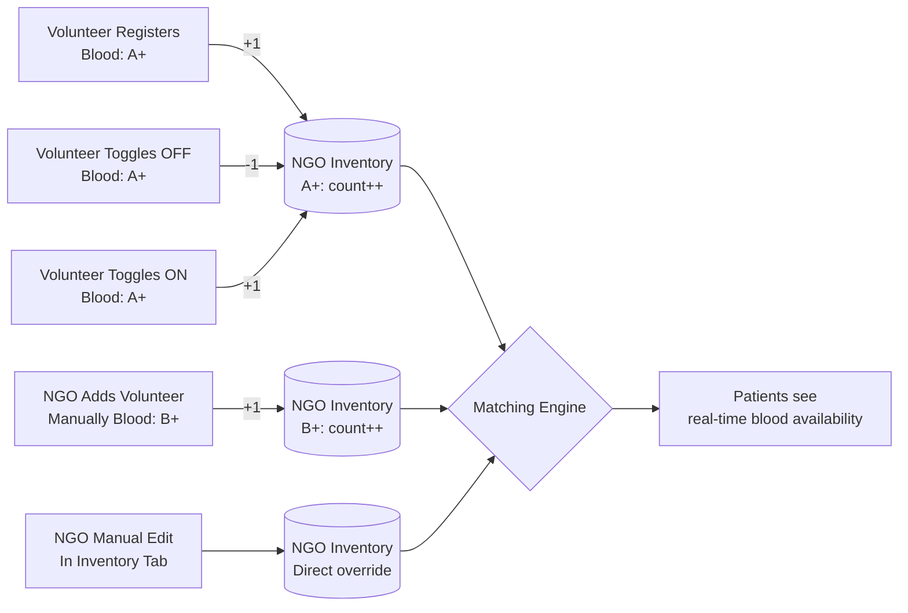

# BloodLink — User Flow Diagrams

## 1. Patient Registration & Manual Match Flow



---

## 2. Automatic Match Dispatch Flow

```mermaid
flowchart TD
    A([Patient selects Automatic Mode]) --> B[Fill 3-step Form]
    B --> C[Submit Form]
    C --> D[System saves to BloodRequests table]
    D --> E[Click: Start Automatic Match]
    E --> F[Frontend sends autoMatch:start to Socket server]
    F --> G[Server: rankCandidates\nScore all donors + NGOs]
    G --> H[Build donor_queue ordered by score]
    H --> I[Status: Searching...]
    I --> J[Dispatch to Queue[0] — nearest donor]
    J --> K[donor:incoming event sent to donor's device]
    K --> L{Donor responds within 2 min?}
    L -->|Accept| M[donor:accept event]
    L -->|Decline| N[donor:reject event]
    L -->|Timeout (2min)| N
    M --> O[Server: lockDonor for 30 min]
    O --> P[Status: Accepted]
    P --> Q[request:matched sent to patient]
    Q --> R([Patient sees donor Name + Phone + Call Now button])
    N --> S{More donors in queue?}
    S -->|Yes| T[Status: Searching...\nDispatch to Queue[index+1]]
    T --> J
    S -->|No| U[Status: Rejected\nNo donors available]
    U --> V([Patient directed to Manual Search / direct NGO contact])
```

---

## 3. NGO Registration & Dashboard Flow



---

## 4. Volunteer Lifecycle Flow



---

## 5. Blood Inventory Sync Flow


