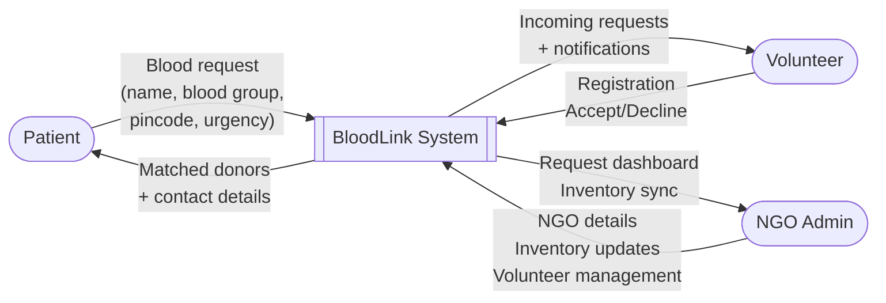
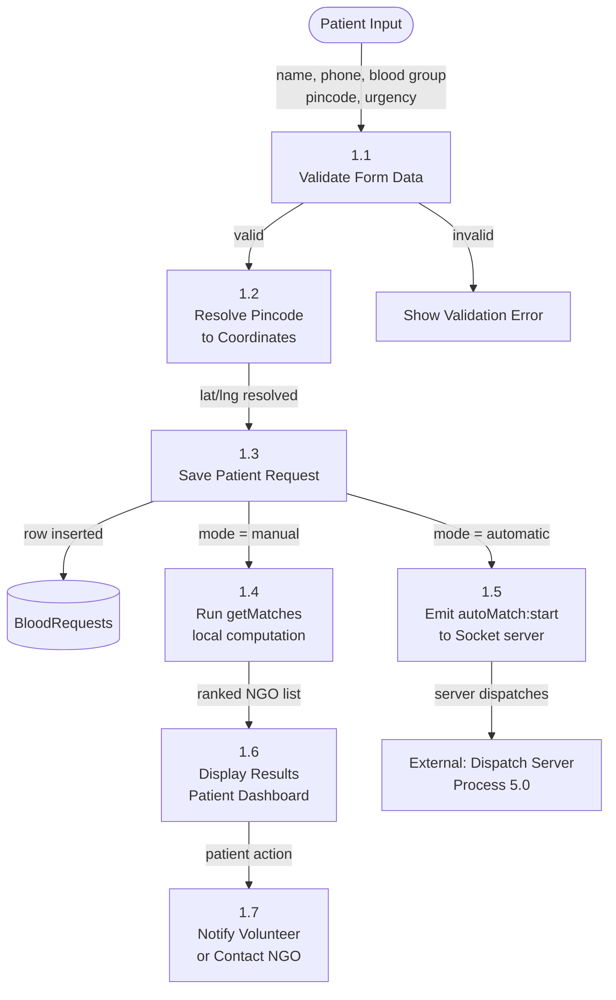

# BloodLink — Data Flow Diagrams (DFD)

## Level 0 — Context Diagram (Highest Level)



---

## Level 1 — Main System Processes

```mermaid
flowchart TD
    P([Patient]) -->|Blood Request Form| P1[1.0\nProcess Patient Request]
    V([Volunteer]) -->|Registration Data| P2[2.0\nVolunteer Management]
    N([NGO Admin]) -->|NGO Registration\n+ Inventory| P3[3.0\nNGO Management]

    P1 -->|Request saved| DS[(BloodRequests\nStore)]
    P2 -->|Volunteer profile| VS[(DonorAvailability\nStore)]
    P3 -->|NGO + stock| NS[(NGOStockReservation\nStore)]

    DS --> P4[4.0\nMatching Engine]
    VS --> P4
    NS --> P4

    P4 -->|Dispatch queue| P5[5.0\nAuto-Match Dispatch\n(Socket.IO Server)]
    P4 -->|Ranked NGOs + volunteers| P6[6.0\nManual Match\nResult Display]

    P5 -->|Incoming request| V
    P5 -->|Accepted match| P
    P6 -->|NGO list with volunteers| P
    P5 -->|Request updates| N
```

---

## Level 2 — Patient Request Process (Process 1.0 Expanded)



---

## Level 2 — Dispatch Process (Process 5.0 Expanded)

```mermaid
flowchart TD
    A[autoMatch:start received] --> P5_1[5.1\nSync NGO stock to server DB]
    P5_1 --> P5_2[5.2\nRank all candidates\nrankCandidates()]
    P5_2 --> P5_3{Any candidates?}
    P5_3 -->|No| R1[Emit Status: Rejected\nNo donors found]
    P5_3 -->|Yes| P5_4[5.3\nDispatchNext\nQueue[index]]
    P5_4 --> P5_5{Candidate type?}
    P5_5 -->|Donor| P5_6[5.4\nEmit donor:incoming\nto donor socket]
    P5_5 -->|NGO| P5_7[5.5\nAuto-accept NGO stock\nreserveNgoStock()]
    P5_6 --> P5_8[5.6\nStart 2-min Timer]
    P5_8 --> P5_9{Donor responds?}
    P5_9 -->|Accept| P5_10[5.7\nlockDonor 30min\nStatus: Accepted]
    P5_9 -->|Decline| P5_11[5.8\nClear timer\nStatus: Searching]
    P5_9 -->|Timeout| P5_11
    P5_10 --> P5_12[5.9\nEmit request:matched\nto patient with donor contact]
    P5_11 --> P5_13{More in queue?}
    P5_13 -->|Yes| P5_4
    P5_13 -->|No| R1
    P5_7 --> P5_12
```

---

## Level 2 — Volunteer Management (Process 2.0 Expanded)

```mermaid
flowchart TD
    A([Volunteer]) -->|Registration form| P2_1[2.1\nValidate Volunteer Data]
    P2_1 -->|valid| P2_2[2.2\nCreate Volunteer Profile]
    P2_2 -->|profile| VS[(DonorAvailability Store)]
    P2_2 -->|ngoId + bloodGroup| P2_3[2.3\nAuto-update NGO Inventory\n+1 for blood group]
    P2_3 --> NS[(NGOStockReservation)]
    P2_2 --> P2_4[2.4\nSet User Session\ntype: volunteer]
    P2_4 --> P2_5[2.5\nRegister Socket\nregister:donor]
    P2_5 --> P2_6{Incoming Request?}
    P2_6 -->|donor:incoming| P2_7[2.6\nShow Request Modal\n2-min countdown]
    P2_7 -->|Accept| P2_8[2.7\nEmit donor:accept]
    P2_7 -->|Decline| P2_9[2.8\nEmit donor:reject]
    A2([Returning Volunteer]) -->|phone number| P2_10[2.9\nLookup by phone\nloginVolunteer()]
    P2_10 --> P2_4
    P2_11[Toggle Availability] --> P2_12[2.10\nUpdate is_available\n±1 NGO inventory]
    P2_12 --> VS & NS
```

---

## Level 2 — NGO Management (Process 3.0 Expanded)

```mermaid
flowchart TD
    A([NGO Admin]) -->|Registration| P3_1[3.1\nValidate NGO Data]
    P3_1 -->|valid| P3_2[3.2\nCreate NGO Record\nAuto-verify]
    P3_2 --> NS[(NGOs Store)]
    P3_2 -->|Map pincode| P3_3[3.3\nResolve Pincode to Coords]
    P3_3 --> NS
    P3_2 --> P3_4[3.4\nSet User Session\ntype: ngo]
    P3_4 --> P3_5{Dashboard Action}
    P3_5 -->|Edit Inventory| P3_6[3.5\nUpdate NGOStockReservation]
    P3_5 -->|Add Volunteer| P3_7[3.6\nregisterVolunteer()\nwith ngoId]
    P3_5 -->|Toggle Volunteer| P3_8[3.7\ntoggleVolunteerAvailability()]
    P3_5 -->|View Requests| P3_9[3.8\nRegister NGO socket\nregister:ngo]
    P3_6 --> NSR[(NGOStockReservation)]
    P3_7 --> VS[(DonorAvailability Store)] & NSR
    P3_8 --> VS & NSR
    P3_9 -->|ngo:newRequest event| P3_10[3.9\nLive request panel update]
```

---

## Data Store Dictionary

| Store | Key | Fields | Notes |
|---|---|---|---|
| `BloodRequests` | `request_id` | patient_name, blood_group, pincode, emergency_level, status, matched_donor_id, donor_queue, current_trial_index | Server-side Map |
| `DonorAvailability` | `donor_id` | is_available, locked_until, current_request_id, socket_id, blood_group, pincode, lat, lng | Server-side Map |
| `NGOStockReservation` | `ngoId-bloodGroup` | units_available, reserved_units | Server-side Map |
| `ngos` (React state) | `ngo.id` | name, phone, pincode, city, inventory, lat, lng, verified | Client AppContext |
| `volunteers` (React state) | `vol.id` | name, phone, bloodGroup, pincode, ngoId, available, joinedAt | Client AppContext |
| `patientRequests` (React state) | `req.id` | fullName, bloodGroup, hospital, city, pincode, urgency, createdAt | Client AppContext |
