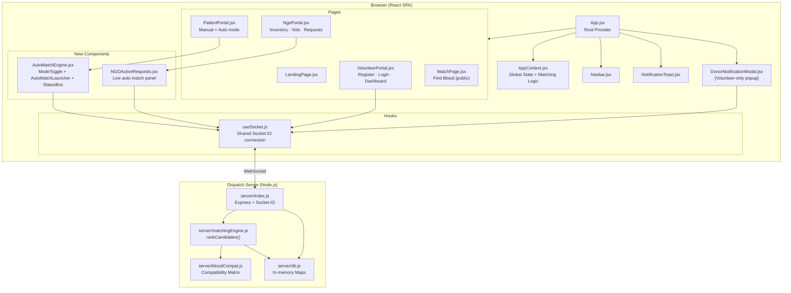
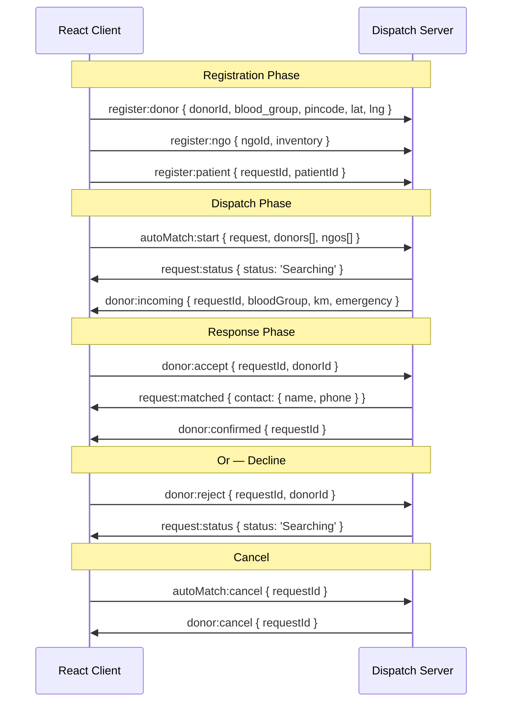
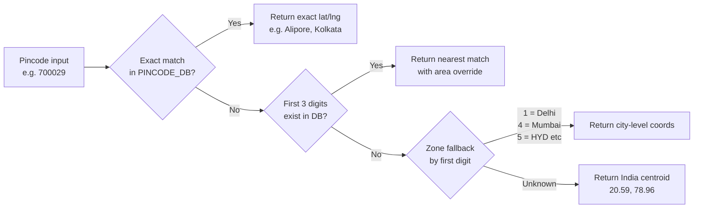

# BloodLink — Technical Architecture

## Component Architecture Diagram



---

## Frontend File Map

```
src/
├── App.jsx                         # Root: wraps AppProvider, renders all pages
├── main.jsx                        # React DOM entry point
├── index.css                       # Global design system (CSS variables, components)
│
├── context/
│   └── AppContext.jsx              # Central state: NGOs, Volunteers, Patients, Matching
│
├── hooks/
│   └── useSocket.js                # Socket.IO client hook (shared connection)
│
├── pages/
│   ├── LandingPage.jsx             # Home: stats, hero, how it works
│   ├── PatientPortal.jsx           # 3-step form + Manual/Auto match results
│   ├── NgoPortal.jsx               # NGO login, dashboard: inventory/volunteers/requests
│   ├── VolunteerPortal.jsx         # Register, login, volunteer dashboard
│   └── MatchPage.jsx               # Public blood finder (no registration needed)
│
└── components/
    ├── Navbar.jsx                  # Top nav with tab routing + user session
    ├── NotificationToast.jsx       # In-app notification toasts
    ├── DonorNotificationModal.jsx  # Full-screen popup for incoming blood requests
    ├── AutoMatchEngine.jsx         # ModeToggle, AutoMatchLauncher, StatusBox
    └── NGOActiveRequests.jsx       # Real-time auto-match requests in NGO dashboard
```

---

## Backend File Map

```
server/
├── index.js                # Express + Socket.IO server (port 3001)
│                           # REST: GET /api/health, GET /api/requests
│                           # Socket events: register, autoMatch, donor:accept/reject
│
├── matchingEngine.js       # rankCandidates(request, donors, ngos)
│                           # Uses Haversine + scoring formula
│
├── db.js                   # In-memory Maps:
│                           #   bloodRequests, donorAvailability, ngoReservations
│                           #   donorSockets, patientSockets, ngoSockets, dispatchTimers
│                           # Helper fns: isDonorAvailable, lockDonor, reserveNgoStock
│
└── bloodCompat.js          # BLOOD_COMPATIBILITY matrix (server-side mirror)
```

---

## State Management Architecture

```mermaid
graph LR
    subgraph AppContext["AppContext (React State)"]
        U[user\nnull | patient | ngo | volunteer]
        N[ngos[]\nNGO records + inventory]
        V[volunteers[]\nAll registered volunteers]
        PR[patientRequests[]\nAll submitted requests]
        NO[notifications[]\nToast queue]
        AT[activeTab\ncurrent page]
    end

    subgraph Actions["Context Actions"]
        rP[registerPatient]
        rN[registerNgo]
        rV[registerVolunteer]
        lV[loginVolunteer]
        sP[submitPatientRequest]
        uI[updateNgoInventory]
        tA[toggleVolunteerAvailability]
        gM[getMatches]
    end

    rV -->|setUser volunteer| U
    rV -->|setNgos inventory++| N
    rV -->|setVolunteers| V
    tA -->|setVolunteers + setNgos ±1| V & N
    rP -->|setUser patient| U
    rN -->|setUser ngo + setNgos| U & N
    sP -->|setPatientRequests| PR
    gM --> N & V
```

---

## Socket.IO Event Architecture



---

## Pincode → Coordinates Resolution


