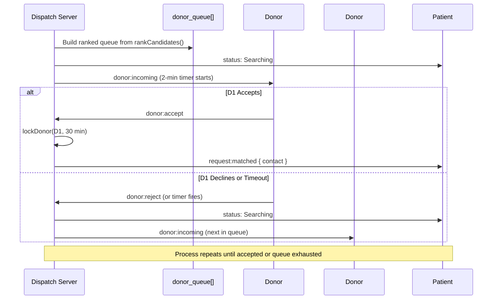

# BloodLink — Matching Engine & Algorithm

## Scoring Formula

The matching engine assigns a score to every candidate (donor or NGO) for a given patient request.

### Score Breakdown

| Condition | Points |
|---|---|
| Blood group is **exact match** (e.g. patient needs A+, donor is A+) | +100 |
| Donor is **available** (not locked by another active request) | +50 |
| NGO has **blood in stock** for a compatible group | +40 |
| Request is **Critical emergency** (< 24 hrs) | +30 |
| **Distance penalty** | −5 × km |

### Formula

```
score = (exactMatch ? 100 : 0)
      + (isDonorAvailable ? 50 : skip_entirely)
      + (ngoHasCompatibleStock ? 40 : skip_entirely)
      + (isCritical ? 30 : 0)
      - (distanceKm × 5)
```

> Locked donors are **skipped entirely**, not penalized.  
> NGOs without compatible stock are **skipped entirely**.

---

## Blood Compatibility Matrix

Standard ABO + Rh compatibility. Defines which blood types a patient can receive from a donor.

```
PATIENT CAN RECEIVE FROM:
A+  → A+, A-, O+, O-
A-  → A-, O-
B+  → B+, B-, O+, O-
B-  → B-, O-
AB+ → A+, A-, B+, B-, AB+, AB-, O+, O-  (Universal Recipient)
AB- → A-, B-, AB-, O-
O+  → O+, O-
O-  → O-                                  (Universal Donor)
```

### Implementation (bloodCompat.js)

```javascript
export const BLOOD_COMPATIBILITY = {
  'A+':  ['A+', 'A-', 'O+', 'O-'],
  'A-':  ['A-', 'O-'],
  'B+':  ['B+', 'B-', 'O+', 'O-'],
  'B-':  ['B-', 'O-'],
  'AB+': ['A+', 'A-', 'B+', 'B-', 'AB+', 'AB-', 'O+', 'O-'],
  'AB-': ['A-', 'B-', 'AB-', 'O-'],
  'O+':  ['O+', 'O-'],
  'O-':  ['O-'],
};
```

---

## rankCandidates() — Step by Step

```mermaid
flowchart TD
    A[Input: request + donors[] + ngos[]] --> B[Get compatible blood groups\nfrom BLOOD_COMPATIBILITY]
    B --> C{For each donor}
    C --> D{Is blood compatible?}
    D -->|No| C2[Skip donor]
    D -->|Yes| E{isDonorAvailable?}
    E -->|Locked| C2
    E -->|Available| F[Start scoring: +100 if exact match\n+50 for availability]
    F --> G{isCritical?}
    G -->|Yes| H[+30]
    G -->|No| I[+0]
    H & I --> J{Lat/lng known?}
    J -->|Yes| K[Calculate Haversine distance\n-5 per km]
    J -->|No| L[No distance penalty\nkm = null]
    K & L --> M[Push to scored array]

    C3{For each NGO} --> N{Has compatible stock?}
    N -->|No| C4[Skip NGO]
    N -->|Yes| O[+100 if exact, +40 for having stock]
    O --> P{isCritical?}
    P -->|Yes| Q[+30]
    P -->|No| R[+0]
    Q & R --> S[Calculate distance penalty\n-5 per km]
    S --> T[Push to scored array]

    M & T --> U[Sort all by score descending]
    U --> V[Return ranked candidates array]
```

---

## Haversine Distance Formula

Used to calculate the great-circle distance between two GPS coordinates.

```
a = sin²(ΔLat/2) + cos(lat1) × cos(lat2) × sin²(ΔLng/2)
d = 2R × atan2(√a, √(1−a))
R = 6371 km (Earth radius)
```

### Implementation

```javascript
function distanceKm(lat1, lng1, lat2, lng2) {
  const R = 6371;
  const dLat = (lat2 - lat1) * Math.PI / 180;
  const dLng = (lng2 - lng1) * Math.PI / 180;
  const a =
    Math.sin(dLat / 2) ** 2 +
    Math.cos(lat1 * Math.PI / 180) * Math.cos(lat2 * Math.PI / 180) *
    Math.sin(dLng / 2) ** 2;
  return R * 2 * Math.atan2(Math.sqrt(a), Math.sqrt(1 - a));
}
```

---

## Dispatch Queue Algorithm



---

## Donor Lock Mechanism

When a donor accepts a request, they are "locked" for **30 minutes**:

```javascript
function lockDonor(donorId, requestId, minutes = 30) {
  donorAvailability.set(donorId, {
    is_available: false,
    locked_until: new Date(Date.now() + minutes * 60 * 1000).toISOString(),
    current_request_id: requestId,
  });
}
```

**Auto-release**: `isDonorAvailable()` checks if `locked_until` has passed and auto-releases the lock.

```javascript
function isDonorAvailable(donorId) {
  const rec = donorAvailability.get(donorId);
  if (!rec) return true; // unknown = assume available
  if (!rec.is_available && new Date() > new Date(rec.locked_until)) {
    rec.is_available = true;  // auto-expire lock
    return true;
  }
  return rec.is_available;
}
```

---

## Scoring Example

**Patient needs: B+ blood, Critical, Pincode 700029 (Kolkata)**

| Candidate | Blood | Distance | Availability | Score Calculation | Final Score |
|---|---|---|---|---|---|
| Volunteer A | B+ | 1.2 km | Available | 100+50+30−6 | **174** |
| Volunteer B | B- | 3.0 km | Available | 0+50+30−15 | **65** |
| Volunteer C | O+ | 2.0 km | Locked | SKIPPED | — |
| NGO X | B+ (5 units) | 0.8 km | — | 100+40+30−4 | **166** |
| NGO Y | O+ (2 units) | 5.0 km | — | 0+40+30−25 | **45** |

**Result queue: [Volunteer A → NGO X → Volunteer B → NGO Y]**
