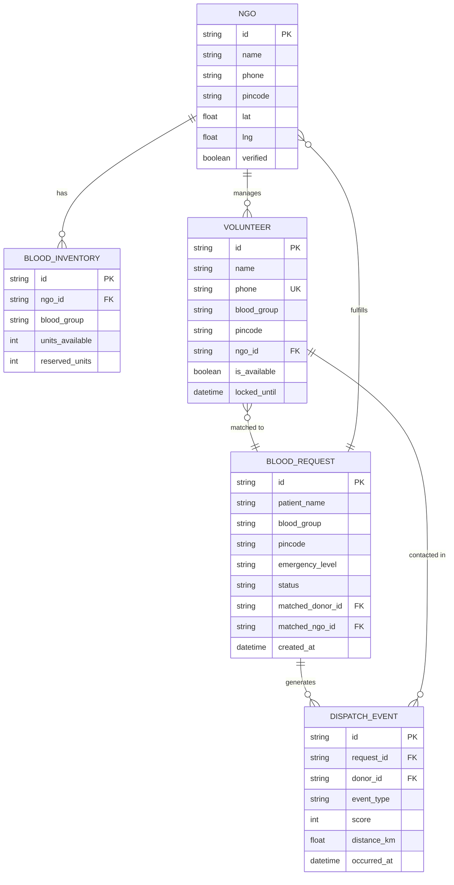

# BloodLink — Database Schema

> **Current state**: In-memory (React state + server-side Maps). This document also provides the production-ready SQL/MongoDB schema for future migration.

---

## Current In-Memory Data Structures

### React State (AppContext)

#### NGOs
```javascript
{
  id: "ngo-1712345678900",       // string, generated: `ngo-${Date.now()}`
  name: "Dangram Blood Donation", // string, required
  email: "contact@dangram.org",  // string
  phone: "9733396486",           // string, required
  city: "D/Dinajpur",            // string
  pincode: "733201",             // string, 6 digits
  address: "Dangram, D/Dinajpur",// string
  regNumber: "WB-NGO-2024-001",  // string
  contactPerson: "Admin Name",   // string
  lat: 25.6107,                  // float, derived from pincode
  lng: 88.0849,                  // float, derived from pincode
  verified: true,                // boolean, auto-true for testing
  registeredAt: "2026-04-11",    // ISO date string
  inventory: {                   // object: blood group → units
    "A+": 5,
    "A-": 0,
    "B+": 3,
    "B-": 1,
    "AB+": 0,
    "AB-": 0,
    "O+": 2,
    "O-": 0,
  }
}
```

#### Volunteers
```javascript
{
  id: "vol-1712345678901",       // string, generated: `vol-${Date.now()}`
  name: "Rahul Sharma",          // string, required
  phone: "9876543210",           // string, required (used for login)
  email: "rahul@email.com",      // string, optional
  bloodGroup: "B+",              // string, one of 8 groups
  pincode: "700029",             // string, 6 digits, required
  address: "Alipore, Kolkata",   // string, optional
  ngoId: "ngo-1712345678900",    // string, FK → NGO.id
  availability: "anytime",       // "anytime" | "weekdays" | "weekends"
  available: true,               // boolean, toggleable
  agreeTerms: true,              // boolean
  joinedAt: "2026-04-11",        // ISO date string
}
```

#### Patient Requests
```javascript
{
  id: 1712345678902,             // number, Date.now()
  fullName: "Ram Kumar",         // string
  age: "34",                     // string
  gender: "Male",                // string
  phone: "9123456789",           // string
  email: "ram@email.com",        // string
  bloodGroup: "A+",              // string
  city: "Kolkata",               // string
  hospital: "RG Kar Medical",    // string
  units: "2",                    // string (number of units needed)
  urgency: "Critical (< 24 hrs)",// string
  pincode: "700001",             // string
  doctorName: "Dr. Sen",         // string, optional
  prescription: "emergency",     // string, optional
  prescriptionId: "RX-2024-001", // string, optional
  notes: "Thalassemia patient",  // string, optional
  status: "pending",             // "pending" | "matched" | "closed"
  createdAt: "2026-04-11T05:00:00Z" // ISO timestamp
}
```

---

### Server-Side Maps (server/db.js)

#### BloodRequests
```javascript
// Map<requestId, BloodRequest>
{
  request_id: "req-1712345678903",
  patient_id: "pat-1712345678904",
  patient_name: "Ram Kumar",
  patient_phone: "9123456789",
  blood_group: "A+",
  pincode: "700001",
  emergency_level: "critical",          // "critical" | "urgent"
  patient_lat: 22.5726,
  patient_lng: 88.3639,
  patient_area: "Dalhousie",
  status: "Searching",                  // see Status Enum below
  matched_donor_id: null,
  matched_ngo_id: null,
  created_at: "2026-04-11T05:00:00Z",
  expires_at: "2026-04-11T05:30:00Z",  // 30 min window
  donor_queue: [                        // ranked candidate array
    { type: "donor", id: "vol-...", score: 174, km: 1.2, phone: "..." },
    { type: "ngo",   id: "ngo-...", score: 166, km: 0.8, name: "..." },
  ],
  current_trial_index: 0               // which queue position we're currently at
}
```

**Status Enum:**
```
Pending    → Request saved, dispatch not started
Searching  → Dispatch started, looking for candidates
Requested  → Contacting current donor (timer running)
Accepted   → Donor confirmed, match complete
Rejected   → No donors accepted
Cancelled  → Patient cancelled
Completed  → Donation confirmed complete
```

#### DonorAvailability
```javascript
// Map<donorId, DonorAvailabilityRecord>
{
  donor_id: "vol-1712345678901",
  is_available: true,
  locked_until: null,                   // ISO timestamp | null
  current_request_id: null,             // requestId | null
  socket_id: "abc123xyz",               // current Socket.IO connection
  name: "Rahul Sharma",
  phone: "9876543210",
  blood_group: "B+",
  pincode: "700029",
  lat: 22.5355,
  lng: 88.3476,
  ngo_id: "ngo-1712345678900",
  ngo_name: "Dangram Blood Donation",
}
```

#### NGOStockReservation
```javascript
// Map<"ngoId-bloodGroup", NGOStockRecord>
// e.g. key: "ngo-1712345678900-B+"
{
  ngo_id: "ngo-1712345678900",
  blood_group: "B+",
  units_available: 5,      // total units in stock
  reserved_units: 1,        // units reserved for active requests
  // effective available = units_available - reserved_units
}
```

---

## Production SQL Schema (PostgreSQL)

```sql
-- NGOs
CREATE TABLE ngos (
  id            UUID PRIMARY KEY DEFAULT gen_random_uuid(),
  name          VARCHAR(200) NOT NULL,
  email         VARCHAR(200),
  phone         VARCHAR(20) NOT NULL,
  city          VARCHAR(100),
  pincode       CHAR(6) NOT NULL,
  address       TEXT,
  reg_number    VARCHAR(100),
  contact_person VARCHAR(200),
  lat           DECIMAL(9,6),
  lng           DECIMAL(9,6),
  verified      BOOLEAN DEFAULT FALSE,
  registered_at TIMESTAMP DEFAULT NOW()
);

-- Blood Inventory (per NGO per blood group)
CREATE TABLE blood_inventory (
  id             UUID PRIMARY KEY DEFAULT gen_random_uuid(),
  ngo_id         UUID REFERENCES ngos(id) ON DELETE CASCADE,
  blood_group    VARCHAR(5) NOT NULL CHECK (blood_group IN ('A+','A-','B+','B-','AB+','AB-','O+','O-')),
  units_available INTEGER DEFAULT 0 CHECK (units_available >= 0),
  reserved_units  INTEGER DEFAULT 0 CHECK (reserved_units >= 0),
  updated_at     TIMESTAMP DEFAULT NOW(),
  UNIQUE(ngo_id, blood_group)
);

-- Volunteers
CREATE TABLE volunteers (
  id           UUID PRIMARY KEY DEFAULT gen_random_uuid(),
  name         VARCHAR(200) NOT NULL,
  phone        VARCHAR(20) NOT NULL UNIQUE,
  email        VARCHAR(200),
  blood_group  VARCHAR(5) NOT NULL,
  pincode      CHAR(6) NOT NULL,
  lat          DECIMAL(9,6),
  lng          DECIMAL(9,6),
  address      TEXT,
  ngo_id       UUID REFERENCES ngos(id),
  availability VARCHAR(20) DEFAULT 'anytime',
  is_available BOOLEAN DEFAULT TRUE,
  agree_terms  BOOLEAN DEFAULT FALSE,
  joined_at    TIMESTAMP DEFAULT NOW()
);

-- Patient Requests
CREATE TABLE blood_requests (
  id                UUID PRIMARY KEY DEFAULT gen_random_uuid(),
  patient_name      VARCHAR(200) NOT NULL,
  patient_phone     VARCHAR(20),
  patient_email     VARCHAR(200),
  blood_group       VARCHAR(5) NOT NULL,
  hospital          VARCHAR(200),
  city              VARCHAR(100),
  pincode           CHAR(6),
  lat               DECIMAL(9,6),
  lng               DECIMAL(9,6),
  units_needed      INTEGER DEFAULT 1,
  urgency           VARCHAR(50),
  emergency_level   VARCHAR(20) DEFAULT 'urgent',
  doctor_name       VARCHAR(200),
  prescription_id   VARCHAR(100),
  notes             TEXT,
  dispatch_mode     VARCHAR(20) DEFAULT 'manual',  -- 'manual' | 'automatic'
  status            VARCHAR(20) DEFAULT 'pending',
  matched_donor_id  UUID REFERENCES volunteers(id),
  matched_ngo_id    UUID REFERENCES ngos(id),
  created_at        TIMESTAMP DEFAULT NOW(),
  expires_at        TIMESTAMP DEFAULT NOW() + INTERVAL '30 minutes'
);

-- Dispatch Events (audit trail)
CREATE TABLE dispatch_events (
  id          UUID PRIMARY KEY DEFAULT gen_random_uuid(),
  request_id  UUID REFERENCES blood_requests(id),
  donor_id    UUID REFERENCES volunteers(id),
  event_type  VARCHAR(30),   -- 'sent', 'accepted', 'rejected', 'timeout', 'cancelled'
  score       INTEGER,
  distance_km DECIMAL(6,2),
  occurred_at TIMESTAMP DEFAULT NOW()
);
```

---

## MongoDB Schema (Alternative NoSQL)

```javascript
// Collection: ngos
{
  _id: ObjectId,
  name: String,
  phone: String,
  pincode: String,
  coords: { lat: Number, lng: Number },
  inventory: Map<bloodGroup, Number>,
  verified: Boolean,
  createdAt: Date
}

// Collection: volunteers
{
  _id: ObjectId,
  name: String,
  phone: String,  // indexed, unique → used for login
  bloodGroup: String,
  pincode: String,
  coords: { lat: Number, lng: Number },
  ngoId: ObjectId,
  available: Boolean,
  lockedUntil: Date | null,
  joinedAt: Date
}

// Collection: bloodRequests
{
  _id: ObjectId,
  bloodGroup: String,
  pincode: String,
  coords: { lat: Number, lng: Number },
  emergencyLevel: String,
  status: String,
  matchedDonorId: ObjectId | null,
  matchedNgoId: ObjectId | null,
  donorQueue: Array<{ type, id, score, km }>,
  currentTrialIndex: Number,
  createdAt: Date,
  expiresAt: Date
}
```

---

## Entity Relationship Diagram (ERD)


